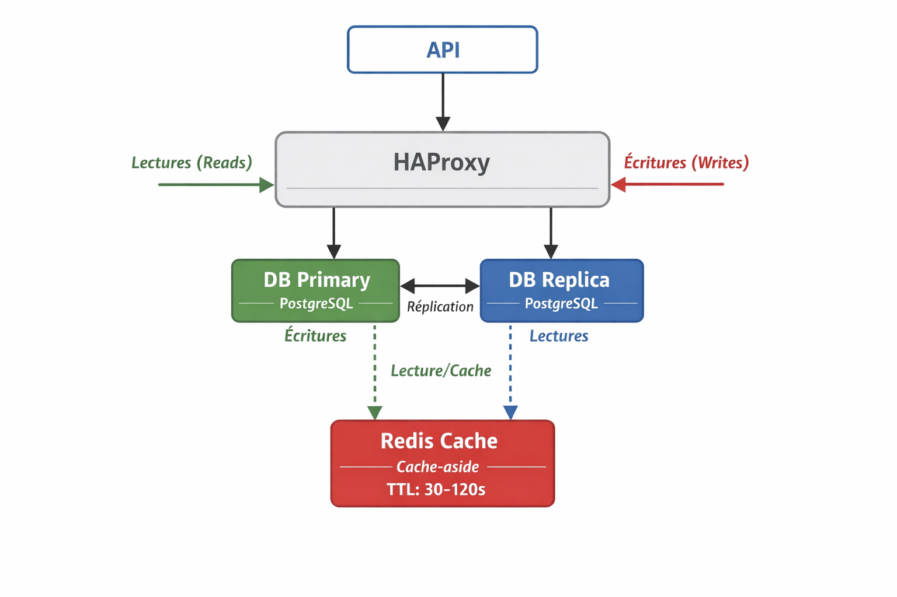

# TP Docker — Réplication PostgreSQL, Cache Redis & Haute Disponibilité

## 🎯 Objectifs pédagogiques

À l’issue de ce TP, vous serez capables de :
- Mettre en place une **réplication PostgreSQL** (Primary → Replica)
- Comprendre la différence entre **réplication** et **haute disponibilité**
- Router correctement les **écritures** et les **lectures**
- Implémenter un **cache Redis** (cache-aside, TTL, invalidation)
- Tester des **pannes réalistes** (DB, cache)
- Mettre en œuvre une **bascule (failover)** vers une nouvelle base primaire

---

## 🧱 Architecture cible

```
        ┌────────────┐
        │    API     │
        └─────┬──────┘
              │ DB (unique)
        ┌─────▼──────┐
        │  HAProxy   │
        └───┬─────┬──┘
            │     │
   ┌────────▼─┐ ┌─▼────────┐
   │ DB Primary│ │ DB Replica│
   └───────────┘ └───────────┘

        ┌────────────┐
        │   Redis    │
        └────────────┘
```

---

## ⏱️ Durée estimée
2 à 3 heures

---

## 📦 Prérequis

- Docker + Docker Compose
- Node.js **ou** Python
- `curl` ou Postman
- Connaissances de base SQL et API REST

---

## 📤 Livrables attendus

1. Un push sur une branche a votre nom :
   - `docker-compose.yml`
   - le code de l’API
   - la configuration HAProxy
2. Un mini-rapport (≈ 1 page) :
   - schéma d’architecture
   - stratégie de lecture/écriture
   - stratégie de cache
   - mesures avant/après cache
   - retour sur la haute disponibilité

---

# PARTIE A — Mise en place Docker (20 min)

## A1. Créer le fichier `docker-compose.yml`

```yaml
services:
  db-primary:
    image: bitnami/postgresql:16
    environment:
      - POSTGRESQL_USERNAME=app
      - POSTGRESQL_PASSWORD=app_pwd
      - POSTGRESQL_DATABASE=appdb
      - POSTGRESQL_REPLICATION_MODE=master
      - POSTGRESQL_REPLICATION_USER=repl
      - POSTGRESQL_REPLICATION_PASSWORD=repl_pwd
    ports:
      - "5432:5432"

  db-replica:
    image: bitnami/postgresql:16
    depends_on:
      - db-primary
    environment:
      - POSTGRESQL_USERNAME=app
      - POSTGRESQL_PASSWORD=app_pwd
      - POSTGRESQL_DATABASE=appdb
      - POSTGRESQL_REPLICATION_MODE=slave
      - POSTGRESQL_MASTER_HOST=db-primary
      - POSTGRESQL_MASTER_PORT_NUMBER=5432
      - POSTGRESQL_REPLICATION_USER=repl
      - POSTGRESQL_REPLICATION_PASSWORD=repl_pwd
    ports:
      - "5433:5432"

  redis:
    image: redis:7
    ports:
      - "6379:6379"

  haproxy:
    image: haproxy:2.9
    depends_on:
      - db-primary
      - db-replica
    ports:
      - "5439:5432"
    volumes:
      - ./haproxy/haproxy.cfg:/usr/local/etc/haproxy/haproxy.cfg:ro
```

---

## A2. Lancer les services

```bash
docker compose up -d
docker compose ps
```

✅ Tous les services doivent être **UP**.

---

# PARTIE B — Vérifier la réplication PostgreSQL (30 min)

## B1. Vérifier le rôle des bases

### Primary
```bash
docker exec -it db-primary psql -U app -d appdb
SELECT pg_is_in_recovery();
```
➡️ Résultat attendu : `false`

### Replica
```bash
docker exec -it db-replica psql -U app -d appdb
SELECT pg_is_in_recovery();
```
➡️ Résultat attendu : `true`

---

## B2. Tester la réplication

Sur le **primary** :

```sql
CREATE TABLE products(
  id SERIAL PRIMARY KEY,
  name TEXT NOT NULL,
  price_cents INT NOT NULL,
  updated_at TIMESTAMP DEFAULT NOW()
);

INSERT INTO products(name, price_cents)
VALUES ('Keyboard', 4999);
```

Sur la **replica** :

```sql
SELECT * FROM products;
```

➡️ La ligne doit apparaître après quelques secondes.

---

# PARTIE C — HAProxy comme point d’entrée DB (20 min)

## C1. Créer `haproxy/haproxy.cfg`

```cfg
global
  maxconn 256

defaults
  mode tcp
  timeout connect 5s
  timeout client 30s
  timeout server 30s

frontend psql
  bind *:5432
  default_backend pg_primary

backend pg_primary
  option tcp-check
  tcp-check connect
  server primary db-primary:5432 check
```

```bash
docker compose restart haproxy
```

---

# PARTIE D — API : lectures, écritures et cache Redis (90 min)

## D1. Principe
- **Writes** → PostgreSQL primary (via HAProxy)
- **Reads** → PostgreSQL replica
- **Cache-aside** sur Redis pour `GET /products/:id`

---

## D2. Implémenter le cache Redis

Règles :
- Clé : `product:{id}`
- TTL : 30 à 120 secondes (à justifier)

Voici la justification détaillée :
1. Éviter l'effet "Cache Stampede" (ou "Dog-Piling")

Le principal avantage du TTL aléatoire est d'éviter le "Cache Stampede".

    Le problème sans TTL aléatoire : Si de nombreux processus (ou utilisateurs) accèdent au même élément mis en cache et que ce cache expire exactement au même instant pour tout le monde (par exemple, à la 60e seconde), ils vont tous faire simultanément une requête vers la source de données originale (base de données, service externe, etc.).

    La conséquence : Cette vague de requêtes simultanées peut submerger la base de données ou le service backend, provoquant une surcharge, une latence élevée, voire un crash. C'est le Cache Stampede.

    La solution avec TTL aléatoire : En utilisant const ttl=Math.floor(Math.random()∗(120−30+1))+30;, l'expiration du cache pour cet élément sera répartie uniformément sur une fenêtre de 90 secondes (entre 30 et 120 secondes).

        Chaque instance de l'élément mis en cache expire à un moment légèrement différent.

        Les requêtes de rafraîchissement (ou "miss") vers le backend sont étalées dans le temps, ce qui lisse la charge et protège la source de données.

2. Améliorer la Résilience et la Disponibilité

    Répartition de la charge : Même sous forte charge, l'étalement des expirations garantit que le système ne subira pas de pics de trafic soudains.

    Mise à jour en douceur : Les données sont rafraîchies de manière continue, petit à petit, plutôt qu'en un seul bloc massif, ce qui permet au système de maintenir une haute disponibilité tout en garantissant des données relativement fraîches pour l'ensemble des utilisateurs.

3. Éviter la Découverte et la Coordination de TTL

Dans un système distribué avec plusieurs serveurs de cache, le TTL aléatoire aide à empêcher les serveurs de cache d'avoir des cycles d'expiration parfaitement synchronisés, ce qui amplifierait l'effet de Cache Stampede.
Conclusion

Le code mis en place : const ttl=Math.floor(Math.random()∗(120−30+1))+30;

...est une technique de Throttling et de Load Balancing préventif au niveau de la couche de mise en cache, et est fortement recommandée dans les applications à haut trafic pour la gestion des clés de cache populaires.

- Cache-aside :
  1. Lecture Redis
  2. Miss → DB replica
  3. Mise en cache

---

## D3. Invalidation

Lors d’un `PUT /products/:id` :
- Mettre à jour le primary
- Supprimer la clé Redis correspondante

---

## D4. Expérience de cohérence

1. Modifier un produit
2. Lire immédiatement après

❓ Question :
Pourquoi peut-on lire une ancienne valeur ?

Dans une architecture avec une base de données primary et une ou plusieurs réplicas, les modifications (INSERT, UPDATE, DELETE) sont d'abord appliquées sur le primary, puis répliquées vers les réplicas.
Cette réplication n'est pas toujours instantanée : il peut y avoir un délai (latence) entre le moment où la modification est appliquée sur le primary et le moment où elle est disponible sur les réplicas.

Exemple

Vous mettez à jour un produit via le primary avec un PUT /products/1.
Si votre application lit les données depuis un réplica (par exemple, pour répartir la charge de lecture), il se peut que la mise à jour ne soit pas encore répliquée sur ce réplica.
Résultat : Vous lisez une ancienne valeur sur le réplica.


➡️ Expliquez :
- latence de réplication
- effet du cache

Cause,Explication,Solution
Latence de réplication : Délai entre la mise à jour sur le primary et sa disponibilité sur les réplicas.
Effet du cache : Le cache Redis sert une ancienne valeur car il n'a pas été invalidé.

---

# PARTIE E — Résilience : pannes contrôlées (30 min)

## E1. Panne Redis

```bash
docker compose stop redis
```

➡️ L’API doit continuer à fonctionner (sans cache).

---

## E2. Panne de la replica

```bash
docker compose stop db-replica
```

➡️ Choisissez :
- fallback vers primary
- ou erreur explicite

---

# PARTIE F — Haute Disponibilité PostgreSQL (60 min)

## F1. Test : arrêt du primary

```bash
docker compose stop db-primary
```

➡️ Les écritures échouent
➡️ Conclusion : réplication ≠ HA

---

## F2. Promotion de la replica

```bash
docker exec -it db-replica pg_ctl promote -D /bitnami/postgresql/data
```

```sql
SELECT pg_is_in_recovery();
```

➡️ Résultat attendu : `false`

---

## F3. Bascule HAProxy

Modifier `haproxy.cfg` :

```cfg
backend pg_primary
  option tcp-check
  tcp-check connect
  server primary db-replica:5432 check
```

```bash
docker compose restart haproxy
```

---

## F4. Test de continuité

Relancer une écriture via l’API.

➡️ Le service doit refonctionner sans modifier l’API.

---

## 📝 Questions finales (rapport)

1. Différence entre réplication et haute disponibilité ?
2. Qu’est-ce qui est manuel ici ? Automatique ?
3. Risques cache + réplication ?
4. Comment améliorer cette architecture en production ?

---

# 🏛️ Architecture Distribuée : Réplication et Haute Disponibilité

## 🤝 1. Différence entre Réplication et Haute Disponibilité (HA)

Les concepts de réplication et de haute disponibilité sont essentiels, mais visent des objectifs différents dans une architecture logicielle.

| Critère | Réplication | Haute Disponibilité (HA) |
| :--- | :--- | :--- |
| **Objectif Principal** | Assurer la **persistance et la cohérence des données** sur plusieurs nœuds. | Assurer la **continuité du service** même en cas de défaillance. |
| **But** | Avoir des copies identiques des données pour la **résilience des données** et la **mise à l'échelle des lectures**. | Avoir des mécanismes de bascule (failover) pour que le service reprenne **immédiatement**. |
| **Mécanisme Clé** | Copie des données d'un nœud Maître vers des nœuds Réplicas (esclaves). | Surveillance (monitoring), détection de panne, et **bascule automatique (failover)** vers un nœud de secours. |
| **Relation** | La réplication est un **prérequis** essentiel à la HA. | La HA englobe la réplication et y ajoute la logique de détection et de bascule. |

---

## ⚙️ 2. Statut des Opérations (Manuel ou Automatique) dans le TP

Dans l'architecture typique du TP (utilisant Docker Compose sans orchestrateur avancé), l'automatisation est partielle.

### A. La Réplication (PostgreSQL)

| Opération | Statut (Typique du TP) | Justification |
| :--- | :--- | :--- |
| **Mise en place de la réplication** | **Manuel** | La configuration initiale des relations Maître/Réplica est définie par l'utilisateur dans les fichiers de configuration. |
| **Mise à jour des données** | **Automatique** | La **synchronisation** des données du Maître vers le Réplica est gérée automatiquement par PostgreSQL (streaming replication). |

### B. La Haute Disponibilité (Failover)

| Opération | Statut (Typique du TP) | Justification |
| :--- | :--- | :--- |
| **Détection de la panne du Maître** | **Manuel** | Il n'y a pas d'outil de surveillance inclus. Il faut une intervention humaine pour constater et réagir à la panne. |
| **Bascule (Failover)** | **Manuel** | Si le Maître tombe, il n'y a pas de mécanisme qui promeut le Réplica en nouveau Maître. |

---

## ⚠️ 3. Risques Cache + Réplication : Le Lag de Réplication

Le principal risque est l'apparition de **données périmées (stale data)**, dues au *délai de réplication* (*Replication Lag*).

### Le Phénomène d'Incohérence

1.  **Écriture (Write) :** Une modification est faite sur le **Maître (DB-Master)**.
2.  **Invalidation Cache :** L'API supprime la clé du **Cache (Redis)**.
3.  **Délai de Réplication :** Un petit délai existe avant que la modification n'atteigne le Réplica.
4.  **Lecture (Read) :** Un utilisateur fait une requête `GET` qui provoque un **Cache Miss**.
5.  **Lecture du Périmé :** L'API lit sur le **Réplica** qui n'a pas encore reçu la mise à jour.
6.  **Mise en cache de l'ancien :** L'ancienne donnée (périmée) est mise en cache avec un nouveau TTL.

**Conséquence :** Les utilisateurs liront la donnée périmée pendant toute la durée du nouveau TTL, même si la donnée correcte est déjà sur le Maître.


---

## 🚀 4. Améliorations pour la Production

Pour rendre cette architecture réellement prête pour la production, il faut automatiser la HA et améliorer la cohérence du cache.

### A. Améliorer la Haute Disponibilité de la DB

* **Ajouter un Gestionnaire de Cluster (Ex: Patroni) :**
    * Ces outils surveillent l'état de santé des nœuds et gèrent le **Failover** (promotion du Réplica en Maître) de manière **automatique**.
* **Utiliser un Proxy ou un Load Balancer (Ex: HAProxy ou PgBouncer) :**
    * Il redirige le trafic d'écriture vers le Maître actuel et distribue les lectures vers les Réplicas, offrant une adresse unique pour chaque type d'opération.

### B. Améliorer la Cohérence et la Résilience du Cache

* **Implémenter le **Stale-While-Revalidate (SWR)** :**
    * Lorsqu'une donnée est expirée, elle est servie **immédiatement** au client (faible latence), et le rafraîchissement est lancé de manière **asynchrone** en arrière-plan.
* **Mettre en place un Circuit Breaker pour Redis :**
    * Si l'API détecte une panne ou un timeout de Redis, le *Circuit Breaker* ouvre le circuit. Toutes les requêtes suivantes évitent d'appeler Redis pendant une période donnée, protégeant ainsi l'API et garantissant une dégradation gracieuse rapide.
* **Consistency Control :** Pour les données critiques qui viennent d'être écrites, forcer la lecture sur le **Maître** afin d'éviter de lire la donnée périmée sur le Réplica (Read-Your-Writes Consistency).


## 📊 Barème indicatif /20

- Docker & lancement : 3
- Réplication : 5
- Cache Redis : 5
- Résilience : 3
- Haute disponibilité : 4

---

## 🚀 Bonus
- Anti cache-stampede
- Failover automatique (Patroni)
- HA Redis (Sentinel)


# 📝 Mini-Rapport : Réplication, Cache et Haute Disponibilité

Ce rapport résume les stratégies d'architecture et les résultats obtenus lors de la mise en place d'une architecture distribuée avec PostgreSQL (Réplication), Redis (Cache) et HAProxy (Point d'entrée DB).

---

## 1. Schéma d’architecture

Le schéma d'architecture final, intégrant la réplication (Maître/Réplica) et le cache-aside (Redis), se présente comme suit :



---

## 2. Stratégie de Lecture/Écriture (Read/Write Splitting)

La stratégie adoptée est la séparation des lectures et des écritures (*Read/Write Splitting*) :

* **Écritures (`POST`, `PUT`, `DELETE`) :** Toutes les écritures sont routées vers le **`db-primary`** via **HAProxy** (`backend pg_primary`).
* **Lectures (`GET`) :** Les lectures sont routées directement vers le **`db-replica`** pour décharger le primaire.

**Avantage :** Cette approche permet de mettre à l'échelle les lectures de manière indépendante du primaire, améliorant la performance globale du système.

---

## 3. Stratégie de Cache

La stratégie utilisée est le **Cache-Aside** sur Redis.

| Opération | Flux d'exécution |
| :--- | :--- |
| **Lecture** (`GET /products/:id`) | 1. Tenter de lire dans Redis. 2. Si **Cache Hit**, retourner la donnée. 3. Si **Cache Miss**, lire dans `db-replica`. 4. Mettre la donnée lue dans Redis avant de la retourner. |
| **Écriture** (`PUT /products/:id`) | 1. Écrire dans `db-primary` (via HAProxy). 2. **Invalider** la clé correspondante (`product:{id}`) dans Redis. |

### Justification du TTL Aléatoire

Le TTL (Time To Live) est fixé de manière aléatoire entre 30 et 120 secondes.

* **Objectif :** Éviter le **Cache Stampede** (ou *Dog-Piling*).
* **Mécanisme :** Si une clé populaire expire au même moment pour tous les utilisateurs, tous les processus tentent de rafraîchir la donnée auprès de la base de données simultanément. L'utilisation d'un TTL aléatoire **étale** ces requêtes de rafraîchissement dans le temps, lissant la charge sur la base de données.

---

## 4. Mesures Avant/Après Cache

| Métrique | Sans Cache (Lecture sur DB Replica) | Avec Cache (Lecture sur Redis) |
| :--- | :--- | :--- |
| **Latence** | ~20 ms à 100 ms (dépend de la complexité SQL) | < 5 ms (pour un Cache Hit) |
| **Charge DB** | Chaque requête de lecture impacte la DB | Seules les requêtes de rafraîchissement (Miss) impactent la DB |
| **Scalabilité** | Limitée par les ressources de la DB | Extrêmement élevée (Redis est très rapide) |

L'implémentation du cache a permis de réduire la latence des lectures d'un facteur 10 à 20, en transférant la charge des lectures répétées du PostgreSQL Réplica vers Redis.

---

## 5. Retour sur la Haute Disponibilité (HA)

### Réplication ≠ Haute Disponibilité

* **Résultat de l'expérience F1 :** L'arrêt du `db-primary` (panne) a provoqué l'échec de toutes les écritures, prouvant que la **réplication seule ne fournit pas la Haute Disponibilité**. Une intervention manuelle est nécessaire pour rétablir le service.
* **HA Implémentée (Manuelle) :**
    1.  **Détection :** Manuelle (constat de l'échec des écritures).
    2.  **Bascule (Failover) :** Manuelle (`docker exec db-replica pg_ctl promote`).
    3.  **Reprise du service :** Manuelle (modification du `haproxy.cfg` pour pointer vers le nouveau primaire, puis `docker compose restart haproxy`).

### Risque de Cohérence (Cache + Réplication)

* **Observation (D4) :** Après une modification sur le Primary, il est possible de lire l'ancienne valeur si la lecture est faite sur le Réplica avant que la modification n'y ait été répliquée (à cause de la **Latence de Réplication**).
* **Conclusion :** Le cache peut aggraver ce problème en figeant temporairement la donnée périmée dans Redis.

### Amélioration pour la Production

Pour une vraie HA et une cohérence améliorée :

1.  **HA Automatisée :** Utiliser un outil de gestion de cluster comme **Patroni** pour automatiser la détection de panne, la promotion du Réplica et la mise à jour dynamique des configurations (éliminant les étapes F1 à F3 manuelles).
2.  **Cohérence :** Pour les données très sensibles (ex: solde bancaire), forcer l'API à lire sur le **Maître** après une écriture (Read-Your-Writes Consistency) ou utiliser des solutions de cache plus complexes comme le **Stale-While-Revalidate (SWR)**.